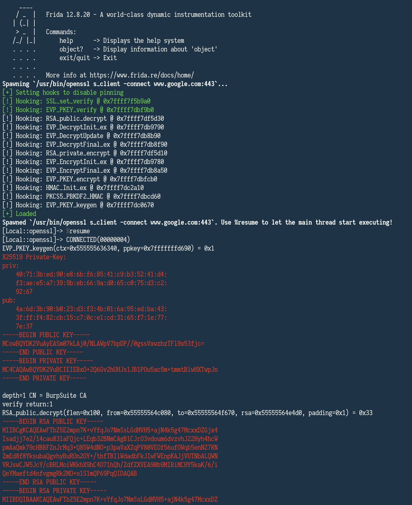

### Fritzl

- Frida hooks and helpers mostly aimed at finding crypto functions.

### How to use

- Modify the `index.js` to suit your needs.
- Use `npm install` to install the dependencies.

#### Option 1: Modify Fritzl directly:

- Use `frida-compile`: `node_modules/.bin/frida-compile index.js -o compiled.js`.
- Load the compiled file: `frida -f </path/to/someapplication> -F -l compiled.js`.

#### Option 2: Include Fritzl

```shell
mkdir myproject \
    && cd myproject \
    && npm init -y \
    && npm install --save-dev frida-compile \
    && npm install --save-dev git+https://github.com/FrankSpierings/fritzl.git \
    && touch index.js
```

__Example index.js:__
```ts
"use strict";

const Fritzl = require('fritzl');

var Utils = Fritzl.Utils;
var Golang = Fritzl.Golang;

Fritzl.disablePinning();
Fritzl.hookDecryption();
Fritzl.hookEncryption();
Fritzl.hookHMAC();
Fritzl.hookKeygen();
Fritzl.hookGoEncryption();

global.Fritzl = Fritzl;
global.hd = Fritzl.hd;
global.ts = Fritzl.ts;

console.log('Regex example: ' + JSON.stringify(Golang.findSymbolsByPattern(/decrypt/i), null, 1));
```

- Compile: `node_modules/.bin/frida-compile index.js -o compiled.js`.

### Notice

- Use the `Utils.telescope` and `Utils.hexdump` to find pointers in memory.
- You might be able to use the `golang.js` module to hook `Golang` executables (as long as that binary is linked to `libc`).

### Steal

- Grab whatever you want or need from this code. I am a lousy developer, so I am sure you will improve it ;)

### Screenshot

